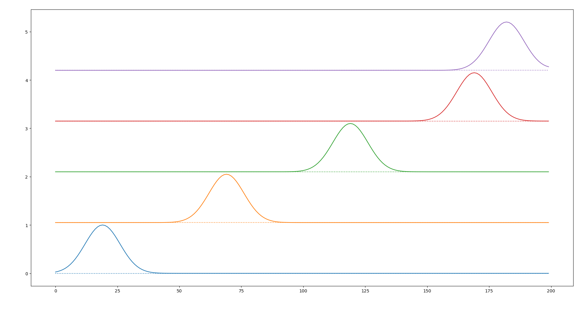
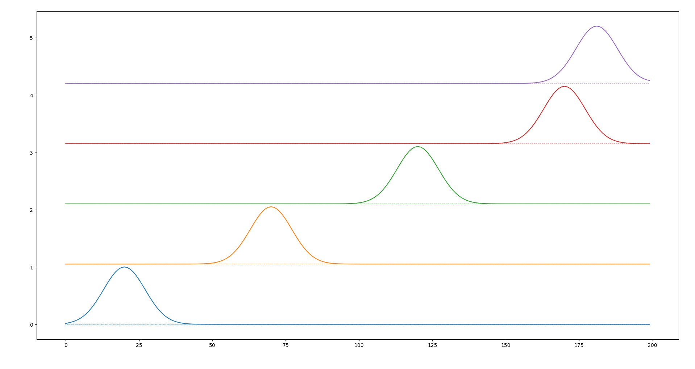
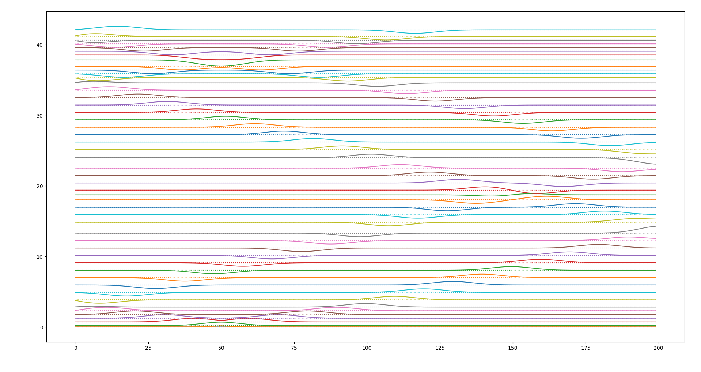
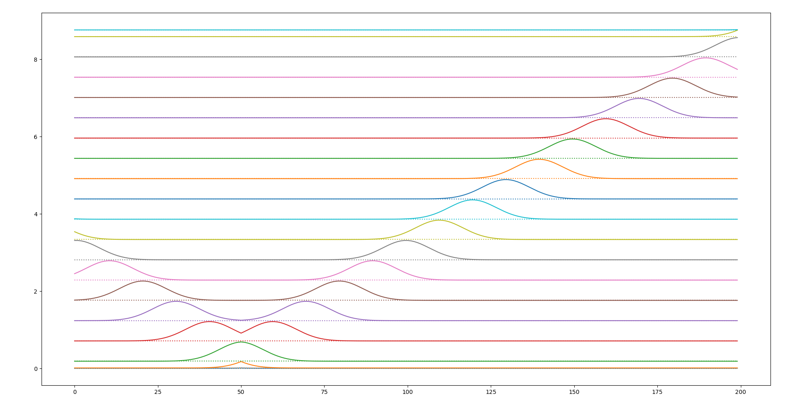
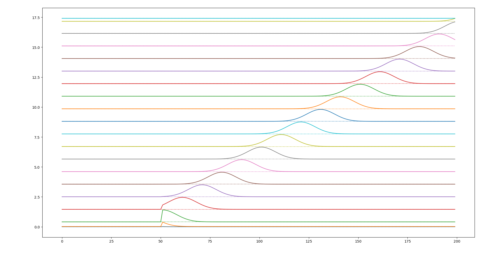
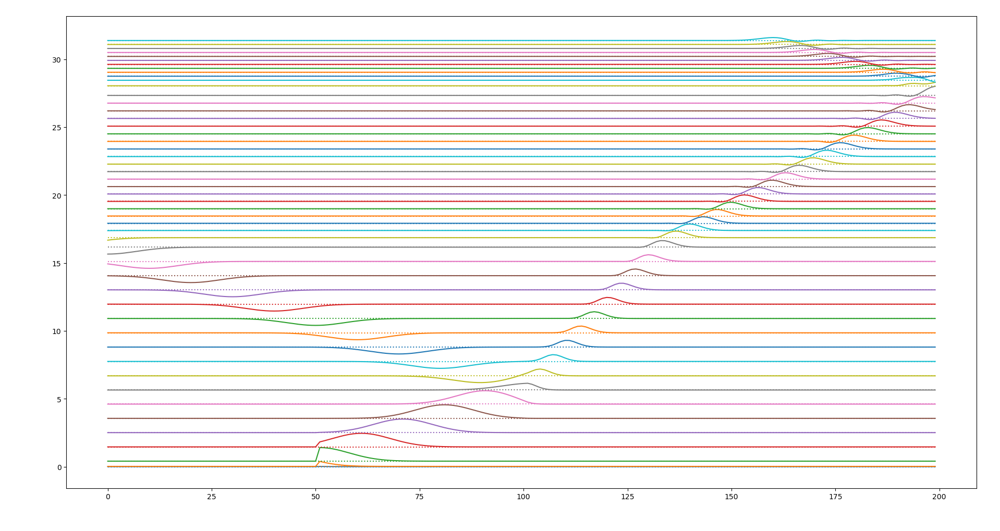
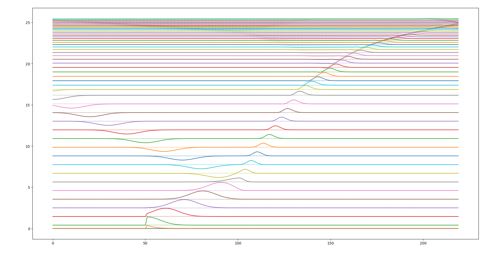
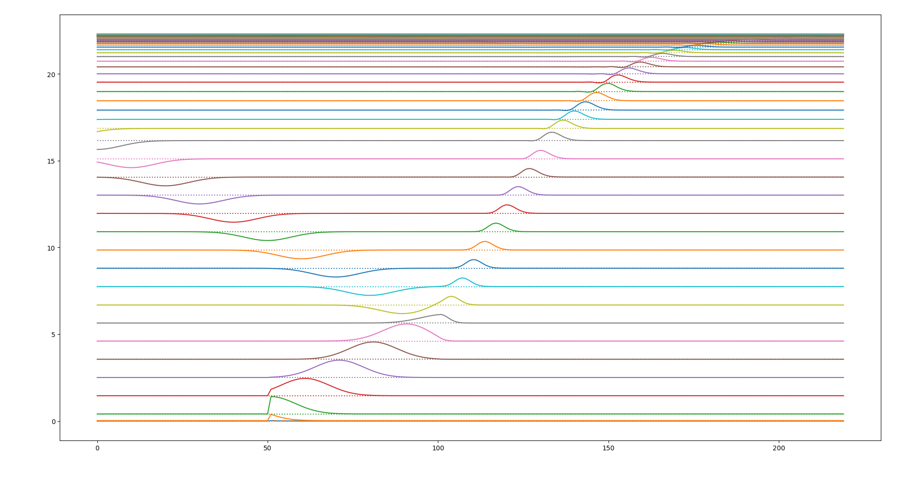

Supplementary code for [uFDTD](https://github.com/john-b-schneider/uFDTD) book by John B. Schneider
written using [PETSc](https://www.mcs.anl.gov/petsc/) distributed computation framework.

Code resides in [examples](./examples) folder.
In order to compile code, you'll need the to install [PETSc](https://www.mcs.anl.gov/petsc/) and
[Open MPI](https://www.open-mpi.org/) libraries:
```bash
sudo apt install petsc-dev libopenmpi-dev
```
All examples are build with two commands:
```bash
cmake -S . -B build
cmake --build build -j $(nproc)
```

Alternatively, you may use GUI to select which examples to build
```
cmake-gui -S . -B build
cmake --build build -j $(nproc)
```

Produced binaries will be located in the appropriate folders inside build folder.

Folder [utils](./utils) contains [Python](https://www.python.org/) plotting scripts.

## Codes

- [ch3.5](./examples/ch3.5/main.c)

  Bare-bones one-dimensional simulation with a hard source.

  To run this code, issue the command
  ``` bash
  mpiexec --host localhost:$(nproc) -n $(nproc) build/examples/ch3.5/ch3.5 -N 200 -Tmax 250 -Tsnap 50
  ```
  where `-N` is a domain size, `-Tmax` is a maximum simulation time, `-Tsnap` is an electric field
  snapshot period.

  Plot the output `output.csv` file with the command:
  ```
  ./utils/waterfall.py output.csv
  ```

  

- [ch3.5-2](./examples/ch3.5-2/main.c)

  [ch3.5](./examples/ch3.5/main.c) modified to use
  [`DMDAVecGetArray`](https://www.mcs.anl.gov/petsc/petsc-current/docs/manualpages/DMDA/DMDAVecGetArray.html).

  To run this code, issue the command
  ``` bash
  mpiexec --host localhost:$(nproc) -n $(nproc) build/examples/ch3.5-2/ch3.5-2 -N 200 -Tmax 250 -Tsnap 50
  ```

  Plot the output `output.csv` file with the command:
  ```
  ./utils/waterfall.py output.csv
  ```

  

- [ch3.8](./examples/ch3.8/main.c)

  Add additive field source.

  To run this code, issue the command
  ``` bash
  mpiexec --host localhost:$(nproc) -n $(nproc) build/examples/ch3.8/ch3.8 -Tmax 500 -Tsnap 10 -SN 50
  ```
  where `-SN` is a field source node.

  Plot the output `output.csv` file with the command:
  ```
  ./utils/waterfall.py output.csv
  ```

  

- [ch3.9](./examples/ch3.9/main.c)

  Apply simple absorbing boundary condition.

  To run this code, issue the command
  ``` bash
  mpiexec --host localhost:$(nproc) -n $(nproc) build/examples/ch3.9/ch3.9 -Tmax 200 -Tsnap 10 -SN 50
  ```

  Plot the output `output.csv` file with the command:
  ```
  ./utils/waterfall.py output.csv
  ```

  

- [ch3.10](./examples/ch3.10/main.c)

  Introduce Total field/Scattered field boundary.

  To run this code, issue the command
  ``` bash
  mpiexec --host localhost:$(nproc) -n $(nproc) build/examples/ch3.10/ch3.10 -Tmax 200 -Tsnap 10 -SN 50
  ```

  Plot the output `output.csv` file with the command:
  ```
  ./utils/waterfall.py output.csv
  ```

  

- [ch3.11](./examples/ch3.11/main.c)

  Add inhomogeneities.

  To run this code, issue the command
  ``` bash
  mpiexec --host localhost:$(nproc) -n $(nproc) build/examples/ch3.11/ch3.11 -Tmax 500 -Tsnap 10 -SN 50 -EPSsplit 100 -EPSl 1.0 -EPSr 9.0
  ```
  where `-EPSsplit` is a node number at which the relative permittivity changes, `-EPSl` is a
  relative permittivity at the left part of the calculation domain, `-EPSl` is a
  relative permittivity at the right part.

  Plot the output `output.csv` file with the command:
  ```
  ./utils/waterfall.py output.csv
  ```

  

- [ch3.11](./examples/ch3.11/main.c)

  Add inhomogeneities.

  To run this code, issue the command
  ``` bash
  mpiexec --host localhost:$(nproc) -n $(nproc) build/examples/ch3.11/ch3.11 -Tmax 500 -Tsnap 10 -SN 50 -EPSsplit 100 -EPSl 1.0 -EPSr 9.0
  ```
  where `-EPSsplit` is a node number at which the relative permittivity changes, `-EPSl` is a
  relative permittivity at the left part of the calculation domain, `-EPSl` is a
  relative permittivity at the right part.

  Plot the output `output.csv` file with the command:
  ```
  ./utils/waterfall.py output.csv
  ```

  

- [ch3.12](./examples/ch3.12/main.c)

  Add lossy layer.

  To run this code, issue the command
  ``` bash
  mpiexec --host localhost:$(nproc) -n $(nproc) build/examples/ch3.12/ch3.12 -N 220 -Tmax 500 -Tsnap 10 -SN 50 -LOSSsplit 150 -Loss 0.01
  ```
  where `-LOSSsplit` is a node number at which the lossy layer starts, `-Loss` is a loss.

  Plot the output `output.csv` file with the command:
  ```
  ./utils/waterfall.py output.csv
  ```

  

- [ch3.12-2](./examples/ch3.12-2/main.c)

  Add lossy layer.

  To run this code, issue the command
  ``` bash
  mpiexec --host localhost:$(nproc) -n $(nproc) build/examples/ch3.12-2/ch3.12-2 -N 220 -Tmax 500 -Tsnap 10 -SN 50 -LOSSsplit 150 -Loss 0.01
  ```
  where `-LOSSsplit` is a node number at which the lossy layer starts, `-Loss` is a loss.

  Plot the output `output.csv` file with the command:
  ```
  ./utils/waterfall.py output.csv
  ```

  
